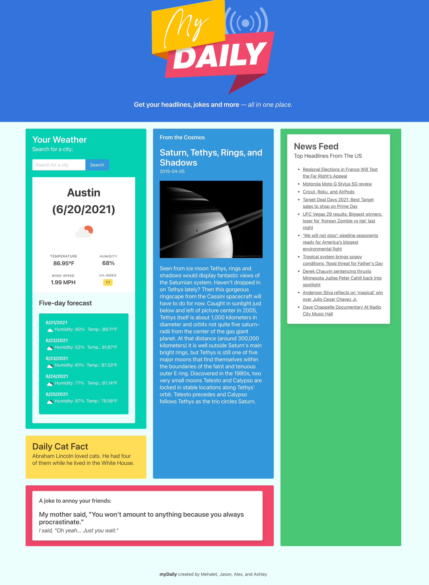

# myDaily

## Table of Contents

- [Overview](#overview)
- [Built With](#built-with)
- [Features](#features)
- [Contact](#contact)
- [Acknowledgements](#acknowledgements)

## Overview

<!-- TODO: Add a screenshot of the live project.
    1. Link to a 'live demo.'
    2. Describe your overall experience in a couple of sentences.
    3. List a few specific technical things that you learned or improved on.
    4. Share any other tips or guidance for others attempting this or something similar.
 -->

Link to live page: https://af-cmdz.github.io/myDaily/

We had hands-on experience with all that we've learned so far which allowed us to bring our ideas to fruition and taught us how to troubleshoot. We also learned that working as a team is way better than working solo.
Having worked through several merge conflicts, we have a better understanding of git. But most us aren't quite confident in fixing git issues, more practice will do us good.
For those who want to work on a similar project: Make sure to pull the latest version of the project before pushing anything to github. Communicate with teammates to avoid git conflicts. Don't get disheartened by not finding a good API at the start.

### Built With

<!-- TODO: List any MAJOR libraries/frameworks (e.g. React, Tailwind) with links to their homepages. -->

HTML, CSS, Javascript, Bulma, APIs, Moment.js, JQuery.

## Features

<!-- TODO: List what specific 'user problems' that this application solves. -->

A time saving landing page for your daily information needs, from news to jokes and everything in between.

## Contact

<!-- TODO: Include icons and links to your RELEVANT, PROFESSIONAL 'DEV-ORIENTED' social media. LinkedIn and dev.to are minimum. -->

https://github.com/AF-cmdZ/myDaily

## Acknowledgements

<!-- TODO: List any blog posts, tutorials or plugins that you may have used to complete the project. Only list those that had a significant impact. Obviously, we all 'Google' stuff while working on our things, but maybe something in particular stood out as a 'major contributor' to your skill set for this project. -->

Bulma.io

Stackoverflow.com
